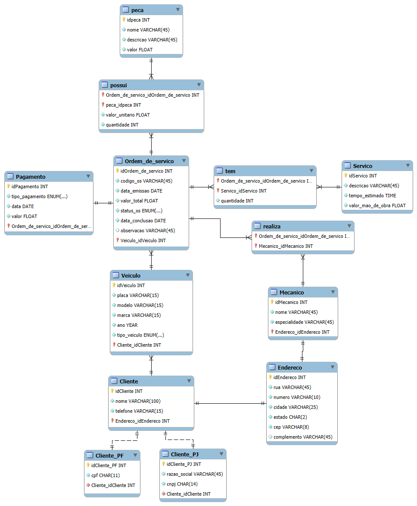

# 🚗 DER - Oficina Mecanica

## 📌 Descrição do Projeto

Este repositório contém a modelagem conceitual do sistema de **controle e gerenciamento de ordens de serviço** para uma oficina mecânica. O objetivo é estruturar todas as entidades, relacionamentos e atributos necessários para representar o funcionamento do sistema.

## 📖 Contexto do Sistema

O sistema gerencia os serviços realizados na oficina mecânica, incluindo:

- **Cadastro de clientes**, diferenciando Pessoa Física (CPF) e Pessoa Jurídica (CNPJ).
- **Registro de veículos**, diferenciando os tipos de veículos (Moto, Carro, Caminhão) e associação aos seus respectivos proprietários.
- **Criação de Ordens de Serviço (OS)** para documentar os serviços a serem realizados.
- **Designação de mecânicos** para cada veículo e OS.
- **Cálculo do valor total da OS**, considerando mão de obra e peças utilizadas.
- **Acompanhamento do status** da OS e da data de conclusão dos serviços.
- **Controle de pagamentos**, diferenciando os tipos de pagamento (PIX, Cartão, Dinheiro).

## 🛠️ Entidades e Relacionamentos

A modelagem conceitual do banco de dados contém as seguintes entidades e atributos:

### **1️⃣ Cliente**
- **idCliente** (PK)
- Nome
- Telefone
- **Endereco_idEndereco** (FK)

### **2️⃣ Cliente_PF** *(Herança da entidade Cliente)*
- **idCliente_PF** (PK, FK → Cliente)
- CPF

### **3️⃣ Cliente_PJ** *(Herança da entidade Cliente)*
- **idCliente_PJ** (PK, FK → Cliente)
- CNPJ
- Razão Social

### **4️⃣ Endereco**
- **idEndereco** (PK)
- Rua
- Número
- Cidade
- Estado
- CEP
- Complemento

### **5️⃣ Veiculo**
- **idVeiculo** (PK)
- Placa
- Modelo
- Marca
- Ano
- **Tipo_Veiculo** (ENUM: Moto, Carro, Caminhão)
- **Cliente_idCliente** (FK)

### **6️⃣ Ordem de Serviço (OS)**
- **idOrdem_de_servico** (PK)
- Código OS
- Data de Emissão
- Valor Total
- Status
- Data de Conclusão
- Observação
- **Veiculo_idVeiculo** (FK)

### **7️⃣ Serviço**
- **idServico** (PK)
- Descrição
- Tempo Estimado
- Valor da Mão de Obra

### **8️⃣ Mecânico**
- **idMecanico** (PK)
- Nome
- Especialidade
- **Endereco_idEndereco** (FK)

### **9️⃣ Peça**
- **idPeca** (PK)
- Nome
- Descrição
- Valor

### **🔟 Pagamento**
- **idPagamento** (PK)
- Tipo de Pagamento (ENUM: PIX, Cartão, Dinheiro)
- Data
- Valor
- **Ordem_de_servico_idOrdem_de_servico** (FK)

### **🔗 Relacionamentos**

- **Ordem de Serviço e Serviços:**
  - Relacionamento **M:N** representado pela entidade **`tem`**, contendo:
    - **idOrdem_de_servico** (FK)
    - **idServico** (FK)
    - Quantidade

- **Ordem de Serviço e Mecânicos:**
  - Relacionamento **M:N** representado pela entidade **`realiza`**, contendo:
    - **idOrdem_de_servico** (FK)
    - **idMecanico** (FK)

- **Ordem de Serviço e Peças:**
  - Relacionamento **M:N** representado pela entidade **`possui`**, contendo:
    - **idOrdem_de_servico** (FK)
    - **idPeca** (FK)
    - Valor Unitário
    - Quantidade

- **Ordem de Serviço e Pagamento:**
  - Relacionamento **1:1**, onde cada OS pode ter um registros de pagamento.

## 📊 Modelo Conceitual

## ✅ Considerações Finais

Caso algum ponto da narrativa não tenha sido especificado com clareza, foram feitas algumas **suposições** baseadas em boas práticas de modelagem de banco de dados. Essas decisões estão documentadas abaixo:

- **Os clientes podem ser Pessoa Física (CPF) ou Jurídica (CNPJ), sendo representados com herança na modelagem.**
- **Cada veículo pertence a um único cliente, mas pode ter múltiplas ordens de serviço ao longo do tempo.**
- **Os veículos foram classificados em três tipos principais: Moto, Carro e Caminhão.**
- **O cálculo da OS considera tanto os serviços prestados quanto as peças utilizadas.**
- **Os mecânicos podem estar associados a múltiplas OS simultaneamente.**
- **Cada serviço tem um tempo estimado e um custo de mão de obra vinculado.**
- **Os pagamentos foram reformulados para incluir um relacionamento com os tipos de pagamento disponíveis considerando pix, dinheiro ou cartão.**